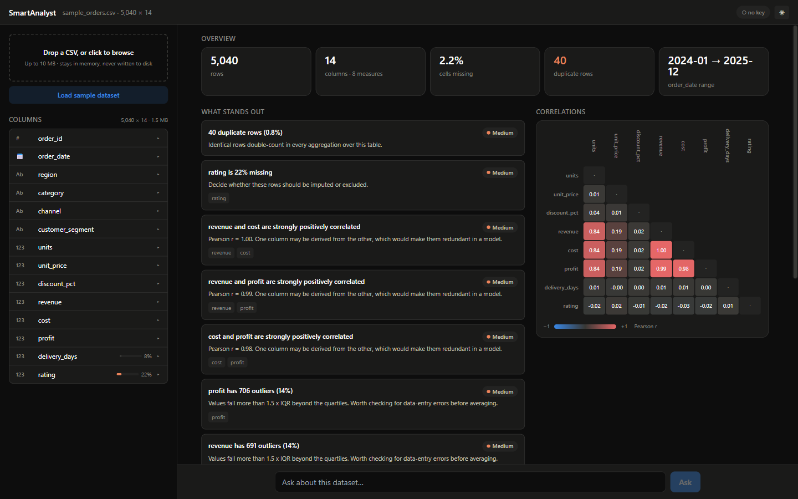
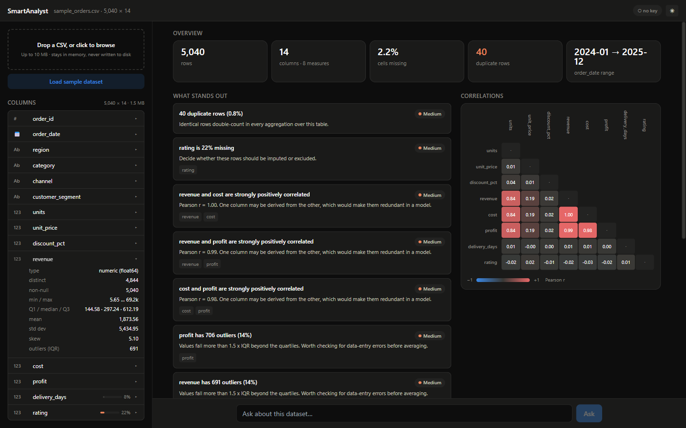
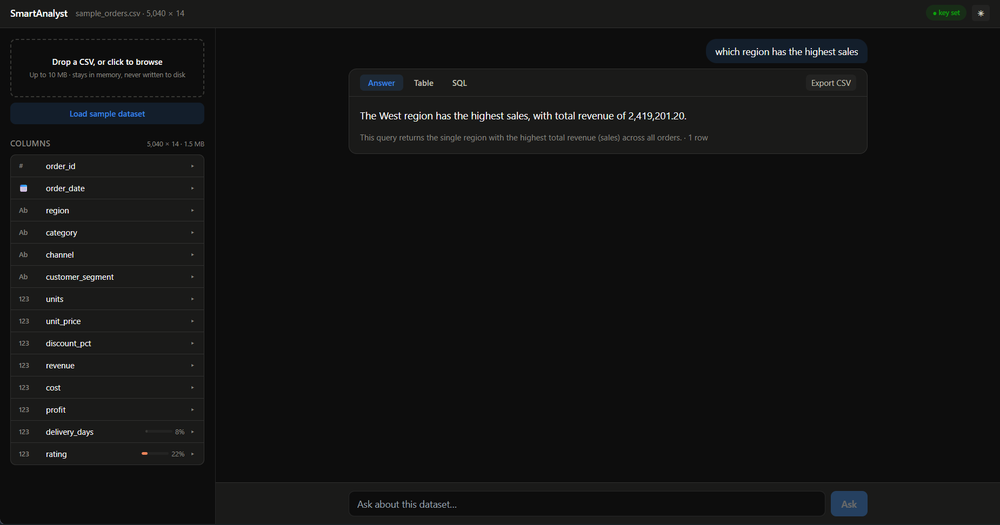
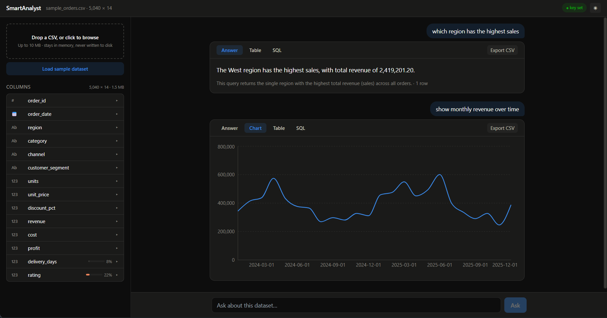
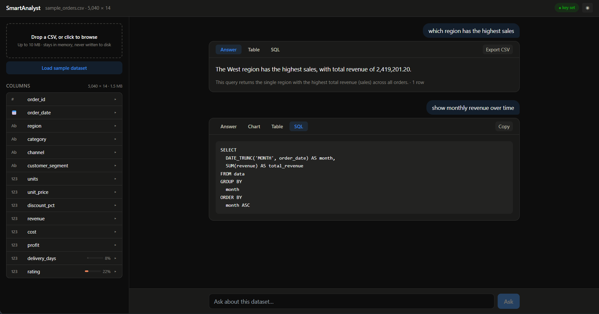
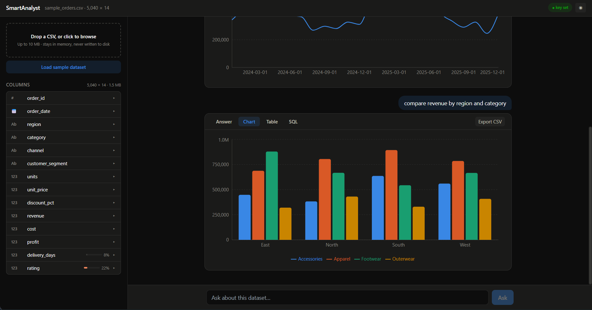
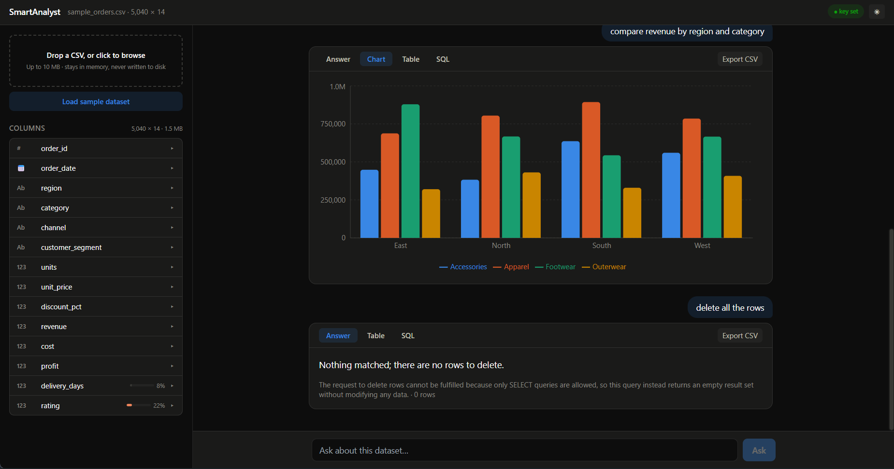
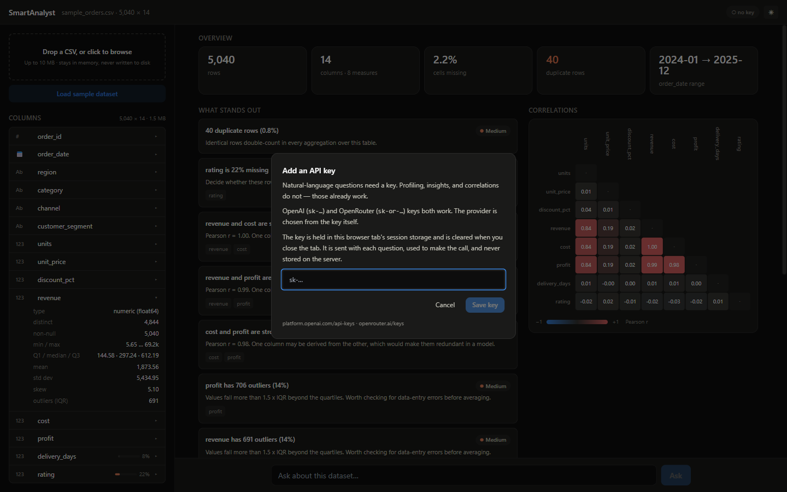
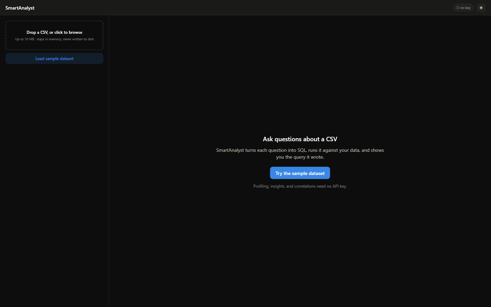
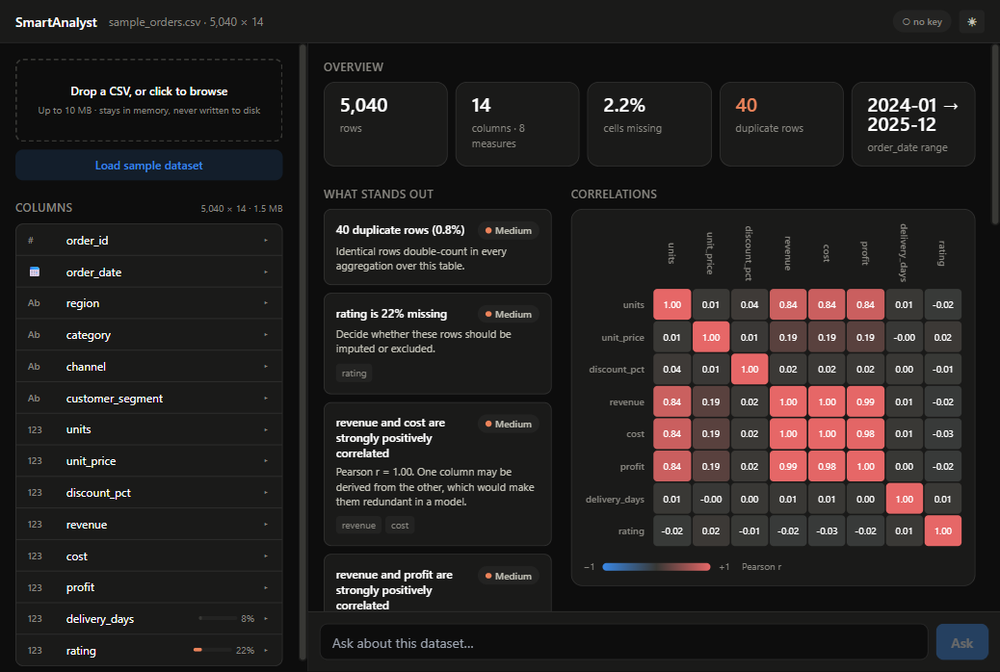

# SmartAnalyst

Upload a CSV, ask questions about it in plain English, and get an answer along with the SQL that produced it.

[](https://github.com/parthpatel2211/SmartAnalyst/actions/workflows/ci.yml)
[](https://www.python.org/)
[](LICENSE)



## What it does

Drop in a CSV and SmartAnalyst profiles it straight away. It works out what each column actually is, measures how much data is missing, finds outliers and correlations, and lists what looks worth knowing. None of that needs an API key, because none of it involves a language model.

Then you can ask it questions. Each question becomes a DuckDB query, which gets checked before it runs, and the query is shown next to the answer so you can see exactly how the number was reached.

## Why it writes SQL instead of Python

The obvious way to build this is to have a model write pandas code and run it with `exec()`. That is what the first version did, and the reasoning for changing it is the main engineering idea in the project.

Running model output as code means running untrusted input as a program. The usual defence is a sandbox: a stripped-down `__builtins__`, a whitelist of permitted names. Sandboxes like that are hard to get right. One reachable import or dunder attribute and the whole machine is available again. The original sandbox here allowed `__import__`, so it was never really a sandbox at all.

A query is a different kind of thing. It is data, not a program. You can parse it into a tree and look at it before anything happens, and it runs inside a database that has no idea what a filesystem is. So instead of trying to contain the danger, the danger stops being possible.

It made the tool better too. Because the query is text rather than hidden code, it can be shown to you on every answer. You can check the logic instead of trusting it.

## What you get

Profiling runs in pandas, so the numbers are the same every time and cost nothing. For each column it reports the inferred type (identifier, measure, category, date, boolean, or text), how much is missing, distinct counts, quartiles, standard deviation, skew, and how many values sit outside 1.5 times the interquartile range.



Seven checks run over the dataset and sort what they find by severity: strong correlations, missing data, columns that never change, skewed distributions, outlier-heavy columns, duplicate rows, and categories too numerous to plot. Correlations between numeric columns are drawn as a heatmap using a diverging scale, so a negative relationship looks different from a positive one rather than merely paler.

## Asking it things

A question gets you a written answer with the real numbers in it. The chart, the table, and the SQL each sit behind a tab.



A chart opens first only if you asked to see one, so a question about which region sold most gets a sentence instead of a graph you did not ask for. Ask for a chart and you get the chart.



That one works because dates are parsed properly on the way in. Left as text, the column would never reach `DATE_TRUNC` and there would be no time axis to plot against.

Every answer carries the query that produced it, laid out to be read rather than squeezed onto one line.



Ask something with two dimensions in it and the second one becomes the series, so the bars group instead of stacking four unlabelled columns onto each tick.



Follow-ups work, because previous questions and their answers go back to the model. "Now filter that to the West" knows what "that" was.

Asking it to change the data does not get you far.



Worth being precise about what that picture shows. The model declined and wrote a query returning nothing, so the guard was never given a `DELETE` to reject. The prompt was obeyed, which is pleasant but is not a security property. What stops a destructive query is the validation described below, and the evidence for that is the test suite rather than a screenshot.

## Bring your own key

Questions need an API key. Everything else does not.



OpenAI keys and OpenRouter keys both work, and the right provider is picked from the key itself. Your key stays in the browser tab's session storage, travels with each request, and is never stored on the server, written to disk, or logged.

## How it fits together

```
Browser  ──  Vercel (static)
   React, TypeScript, Tailwind, Recharts
   Key held in sessionStorage, sent per request as X-OpenAI-Key
        │  HTTPS
        ▼
FastAPI  ──  Render (Docker)
   question ─► model ─► SQL ─► [ SQL GUARD ] ─► DuckDB ─► rows
                                    │
                          rejects anything that is not a
                          single read-only SELECT
        │
        ▼
   results ─► model ─► the written answer
```

There are two model calls per question, and the second one is not an optimisation that got skipped. The first call writes the query before anything has run, which means it has no results to describe and can only tell you what it was trying to do. That is why a one-call version answers "this query returns the total revenue for each region" instead of naming the region. The second call sees the rows and writes the actual finding.

### Endpoints

| Method | Path | What it does | Needs a key |
|---|---|---|---|
| `GET` | `/health` | Liveness, and how the frontend spots a cold start | no |
| `POST` | `/datasets` | Upload a CSV, get back a session and schema | no |
| `GET` | `/datasets/{id}/profile` | Per-column statistics | no |
| `GET` | `/datasets/{id}/insights` | Findings, ranked by severity | no |
| `GET` | `/datasets/{id}/correlations` | Correlation matrix and ranked pairs | no |
| `POST` | `/datasets/{id}/ask` | Question in, answer and SQL and rows out | yes |

## Security

The claim this project makes is that model output never runs as code. Here is what backs that up, and the test suite checks each one.

Nothing in the backend calls `exec`, `eval`, or `compile`. A test reads the source tree and fails the build if any of them turn up.

SQL is checked by parsing it, not by looking at the string. `sqlglot` builds a tree, and the query has to be exactly one statement rooted in a read-only node, with no DDL, DML, `ATTACH`, `COPY`, `PRAGMA`, `INSTALL`, or `LOAD` anywhere inside it. Walking the whole tree matters, because a CTE can hide `DELETE ... RETURNING` behind a `SELECT` at the top.

Functions that read files are refused by name, including `read_csv`, `read_parquet`, `glob`, and the cross-database scanners. The check covers both the anonymous function node and the typed nodes that sqlglot promotes certain functions into. Covering only the first of those let `read_csv` slip through during development, which is how the second one came to be there.

DuckDB itself runs with external access switched off, so a query that somehow got past the guard still cannot touch the filesystem or the network. Queries carry a row limit and a timeout.

The query text is never case-folded. An earlier version lowercased it, which quietly rewrote string literals, and `WHERE region = 'North'` stopped matching anything.

Keys are never kept or printed. They arrive in a header, live in one variable for the length of a single call, and a logging filter strips anything key-shaped in case something upstream tries to echo a request.

The guard's tests cover 27 queries that must be refused and 12 more that came out of deliberately trying to defeat it: multi-statement payloads, statements smuggled past a comment, DML buried in a CTE, function names in odd casing or quoted, and file readers reached through a subquery.

## Running it

```bash
git clone https://github.com/parthpatel2211/SmartAnalyst.git
cd SmartAnalyst
docker compose up
```

That brings the API up on `http://localhost:8000`. The frontend runs separately:

```bash
cd frontend_app
npm install
npm run dev
```

Open `http://localhost:5173` and press "Load sample dataset".



There is a light theme as well, and the charts were checked against both.



### Without Docker

```bash
python -m venv .venv && .venv/Scripts/activate   # source .venv/bin/activate on Unix
pip install -r requirements-dev.txt
uvicorn backend_app.main:app --reload
```

Copy `.env.example` to `.env` if you want to change any setting. Do not put an API key in it. Keys come from whoever is asking the question.

### Tests

```bash
pytest --cov=backend_app          # 226 tests
ruff check .
cd frontend_app && npm test       # 12 tests
```

### The sample data

The bundled dataset comes out of a script that is committed alongside it, rather than arriving as a file nobody can account for. You can read what was deliberately planted in it and then watch the tool find those things: a correlation between revenue and cost, right-skewed prices, missing ratings, duplicated rows, seasonal movement, and bulk orders from the wholesale channel that show up as outliers.

```bash
python scripts/generate_sample_data.py
```

## What it does not do

Session data lives in a dictionary inside one process, so the API cannot be scaled across workers as written. Doing that would need somewhere shared to keep state. For a free-tier deployment this seemed like the right trade, and it is written down here rather than left to be discovered.

Uploads are held in memory, expire after thirty minutes, and are limited in number. Nothing touches disk, which is also why your data does not linger anywhere.

Files are capped at 10 MB and 200,000 rows.

Only questions that SQL can express will work. Grouping, filtering, ranking, and window functions are all fine. Fitting a regression is not.

The API sleeps when nobody is using it and can take up to a minute to wake up. The frontend notices and says so instead of looking broken.

Answers depend on the model behind them. Smaller models sometimes suggest a chart that does not suit the result, so every chart is checked against the columns that actually came back, and anything that does not fit falls back to a shape the data supports.

## Built with

Python 3.11, FastAPI, DuckDB, sqlglot, pandas, pydantic-settings, pytest, and ruff on the backend. Vite, React 19, TypeScript, Tailwind, Recharts, and Vitest on the frontend. Docker, GitHub Actions, Render, and Vercel around the outside.

Charts follow a written method rather than whatever the library does by default. The categorical palette has eight slots used in a fixed order, and it was validated for colour-vision deficiency against both the light and dark backgrounds. Correlation uses a diverging scale so the sign of a relationship is visible. There are no pie charts anywhere, because people read length and position more accurately than they read angle.

## License

MIT. See [LICENSE](LICENSE).
